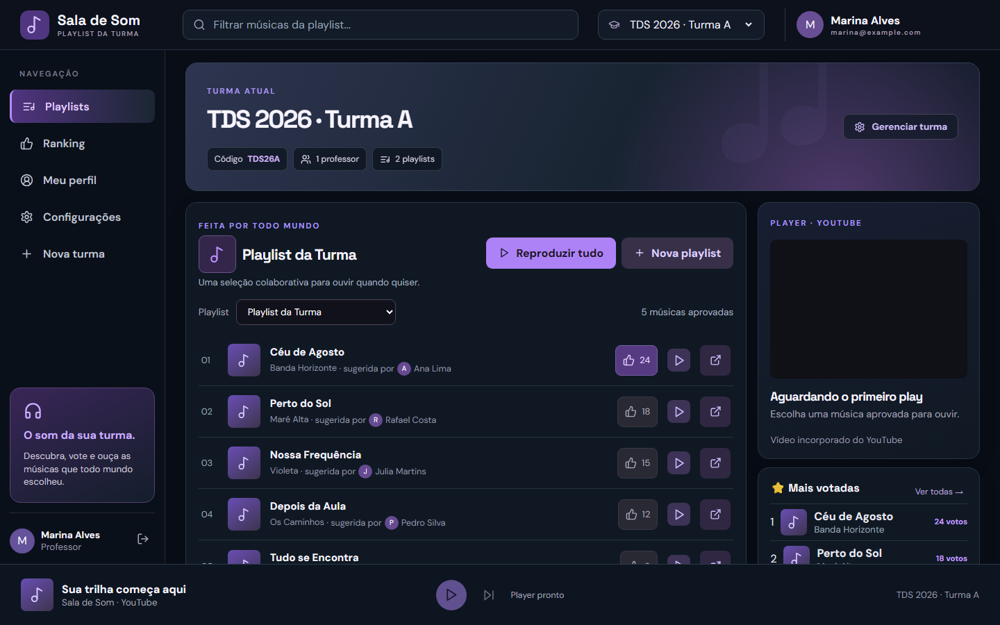
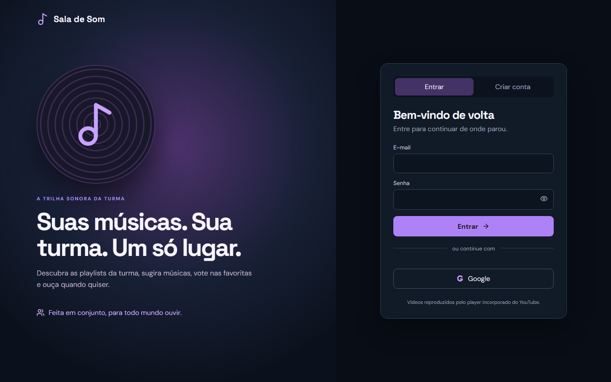
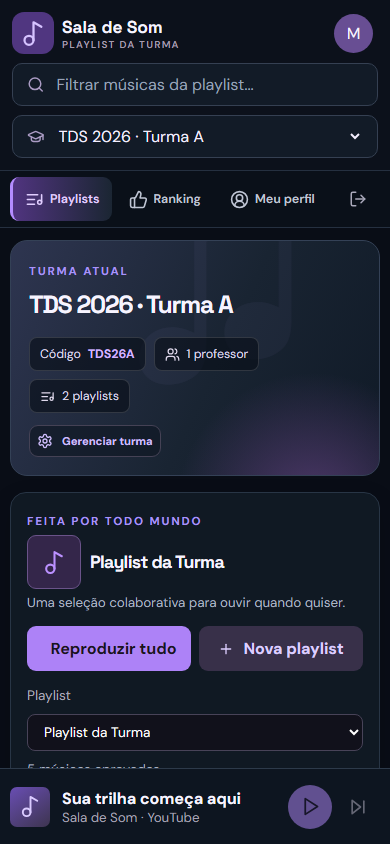

# Sala de Som 🎵

**A playlist colaborativa da turma.** Professores organizam turmas e playlists; alunos sugerem músicas do YouTube ou YouTube Music, votam e ouvem juntos em um player incorporado. A interface funciona no computador e no celular.

<p align="center">
  
</p>

<p align="center"><sub>Capturas da interface real com dados fictícios; nenhuma conta ou turma de produção foi usada.</sub></p>

## Conheça a aplicação

| Acesso | Versão mobile |
| --- | --- |
|  |  |

### O que dá para fazer

- **Turmas:** professores criam turmas e compartilham um código de entrada. Uma turma pode ter vários professores e várias playlists; cada professor pode atuar em várias turmas.
- **Playlists:** responsáveis criam, renomeiam e removem playlists, com capa opcional em JPG, PNG, WebP ou GIF (até 2 MB).
- **Músicas e votos:** alunos sugerem links do YouTube/YouTube Music e votam nas favoritas. A turma pode exigir aprovação do professor e configurar um limite de sugestões por aluno ou deixar sem limite.
- **Reprodução:** músicas aprovadas tocam no player incorporado do YouTube; também é possível abrir o vídeo diretamente no YouTube.
- **Contas:** cadastro com e-mail e senha mediante confirmação por e-mail, login alternativo com Google e perfil com foto. Administradores gerenciam usuários e permissões.

Não é necessária uma chave da YouTube Data API: a aplicação recebe links e usa o player incorporado, sem consultar o catálogo do Google.

## Como usar

1. **Entre ou crie sua conta.** No cadastro por senha, confirme o endereço pelo botão enviado por e-mail. O login com Google é opcional, se estiver configurado na instalação.
2. **Professor:** use **Nova turma**, defina as regras e compartilhe o código. Em **Gerenciar turma**, ajuste a aprovação das sugestões, o limite por aluno, os professores e as playlists.
3. **Aluno:** entre com o código da turma, selecione uma playlist e cole o link de uma música do YouTube ou YouTube Music. Informe título e artista; se a turma exigir moderação, aguarde a aprovação antes de votar e reproduzir.
4. **Todos os membros:** escolham uma música aprovada para reproduzir ou abram o vídeo no YouTube. Em **Ranking**, vejam as mais votadas.
5. **Administrador:** na área **Administração**, gerencie contas e papéis. Também pode administrar as turmas.

## Rodar localmente

Requisitos: **Node.js 20.9+**, npm e PostgreSQL. Clone ou baixe este repositório e execute os comandos na pasta do projeto. O `docker-compose.yml` oferece um PostgreSQL 16 apenas para desenvolvimento; se já tiver um banco externo, não precisa iniciar o Compose.

```bash
npm ci
docker compose up -d postgres
```

Copie `.env.example` para `.env.local` e ajuste pelo menos `DATABASE_URL`, `SESSION_SECRET` (aleatório, 32 ou mais caracteres) e `APP_URL=http://localhost:3000`. O banco de exemplo já corresponde ao Compose. Para permitir **novos cadastros por senha**, configure também `SMTP_HOST`, `SMTP_PORT`, `SMTP_USER`, `SMTP_PASSWORD` e `SMTP_FROM`; o exemplo usa Gmail com senha de app. Sem SMTP, contas existentes ainda podem entrar. Não publique `.env.local`.

```bash
npm run db:migrate
npm run dev
```

Abra **http://localhost:3000**. No PowerShell, se a política de execução bloquear `npm.ps1`, use `npm.cmd` nos comandos acima.

### Login com Google e primeiro administrador

Para oferecer Google como alternativa, configure `GOOGLE_CLIENT_ID` e `GOOGLE_CLIENT_SECRET` e autorize o redirecionamento `http://localhost:3000/api/auth/google/callback` no cliente OAuth. Antes do primeiro acesso, defina `BOOTSTRAP_ADMIN_EMAIL` com o e-mail Google verificado que será administrador. Essa promoção automática só ocorre ao criar uma conta nova pelo Google; cadastros por senha sempre começam como aluno.

## Publicar na Vercel

1. Conecte o repositório à Vercel e use um PostgreSQL externo com backups. O Compose e sua senha de exemplo **não** são para produção.
2. Configure as variáveis de `.env.example` em **Project Settings → Environment Variables**. Use `APP_URL=https://seu-projeto.vercel.app` (ou seu domínio definitivo), um novo `SESSION_SECRET` e credenciais reais. Para limitar tentativas também por IP na Vercel, use `AUTH_IP_HEADER=x-vercel-forwarded-for`. Nunca envie segredos ao GitHub.
3. Faça backup e execute as migrações **fora do build da Vercel**, com acesso ao banco de produção: `npm run db:compile` e depois `npm run db:migrate:prod` com `DATABASE_URL` no ambiente. Não execute migrações de produção em builds de Preview.
4. Teste em Preview com banco e `APP_URL` próprios. Confira o cadastro, o e-mail de confirmação, os perfis de aluno/professor/admin, uploads, votos e reprodução antes de liberar o domínio público.

As portas SMTP 587 (STARTTLS) e 465 (TLS) são aceitas pelo código; na Vercel, não use a porta 25. Para Gmail, use uma conta dedicada com verificação em duas etapas e **senha de app**, nunca a senha normal da conta.

## Verificações e limites conhecidos

```bash
npm run lint
npm run typecheck
npm run build
```

Ainda não há suíte automatizada de testes nem recuperação de senha por e-mail. Vídeos privados, removidos ou sem permissão de incorporação podem falhar apenas na hora de reproduzir. O YouTube não fornece à aplicação uma classificação confiável de conteúdo explícito; a moderação cabe aos professores.

**Tecnologias:** Next.js App Router, React, TypeScript, PostgreSQL, TypeORM e Nodemailer.
